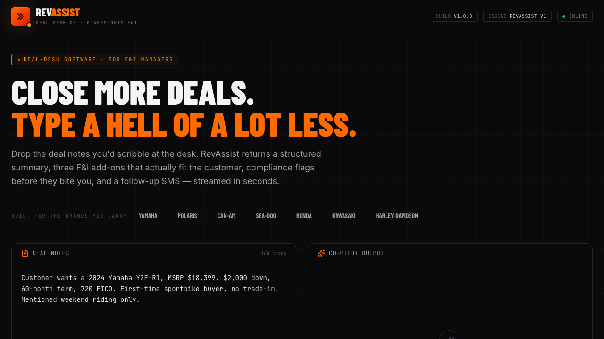

# RevAssist

**Deal Desk OS — an AI co-pilot for powersports dealership F&I teams.**

Drop in raw deal notes, get back a structured deal summary, suggested F&I add-ons, compliance flags, and a ready-to-send customer follow-up SMS — streamed token-by-token in seconds.

**▶ [Live demo](https://codejupiter.github.io/revassist/)** · No login, no API key — runs entirely in your browser.



## Documentation

- [Architecture](docs/ARCHITECTURE.md) — product boundary, current frontend architecture, production backend target, API contract, data model, safety, and eval strategy.

---

## Why this exists

Powersports F&I managers spend hours every week retyping the same customer info into lender portals, hand-writing follow-up texts, and remembering which add-ons make sense for which customer profile. RevAssist collapses that work into one structured AI response.

It's a focused exploration of what AI-augmented internal tooling looks like inside the modern dealership stack — built for the people who actually close deals, not for the marketing team.

Built for the brands the dealer actually carries: Yamaha, Polaris, Can-Am, Sea-Doo, Honda, Kawasaki, Harley-Davidson.

## What it does

Given a deal description like:

> *"Customer wants a 2024 Yamaha YZF-R1, \$2k down, 60-month term, 720 FICO. First-time sportbike buyer, no trade-in."*

RevAssist returns a schema-locked JSON response containing:

- **Deal summary** — 2–3 sentence plain-English recap
- **Suggested add-ons** — 3 F&I products tailored to the customer profile, with rationale and price ranges
- **Compliance flags** — items to verify, color-coded by severity (info / warn / block)
- **Customer follow-up SMS** — a warm, professional 1–2 sentence text ready to copy and send

All four sections render progressively as the response streams in.

## Demo mode

This build runs in **mocked mode** — the streaming response is simulated client-side so the demo runs without an API key in the browser. In production, the LLM call would live behind your own backend with auth, rate limiting, audit logging, and proper key management. The frontend patterns (partial-parse rendering, token-by-token UX, schema-locked output) are the part being demonstrated.

## Run it locally

```bash
cd app
npm install
npm run dev
```

Then open http://localhost:5173. No API key required.

For the production validation suite:

```bash
npm run lint
npm run test
npm run build
npx playwright install chromium
npm run smoke
```

## Stack

- **React 19** with hooks
- **Vite 8** for the dev server and bundle
- **Tailwind CSS v4** via the official Vite plugin
- **Lucide React** for iconography
- **Barlow Condensed + Inter + JetBrains Mono** type stack
- **Vitest** coverage for deal routing, schema validation, partial JSON parsing, and export formatting
- **Playwright** production smoke tests for the full deal workflow on desktop and mobile
- **Streaming LLM backend** for structured JSON generation (production)
- **Token-streaming UX** with partial-JSON parsing as content arrives

## Architecture notes

- **Isolated deal engine**: sample deals, mock response selection, schema validation, partial parsing, and copy/export formatting live in `src/lib/dealEngine.js` so the product logic can be tested independently of React.
- **Schema-locked output**: the system prompt forces the model to return strict JSON. The frontend parses the stream incrementally and renders each section as soon as it's structurally valid.
- **Optimistic partial render**: as tokens arrive, a parse attempt runs on every chunk. The first valid parse swaps the raw stream view for the structured render.
- **Production backend path**: [docs/ARCHITECTURE.md](docs/ARCHITECTURE.md) documents the authenticated streaming API, data model, rate limits, audit logs, and evals needed to turn the browser demo into a SaaS workflow.
- **Latency surfaced**: response time and token count are exposed in the UI for transparency.
- **Three sample deals** (sportbike / UTV / PWC) included for fast testing.

## Deploy

The `main` branch auto-deploys to GitHub Pages via [.github/workflows/deploy.yml](.github/workflows/deploy.yml). The workflow installs from lockfile, runs a production audit, lints, runs unit tests, builds the Vite bundle, runs Chromium smoke tests, then deploys the artifact. To enable:

1. Push to `main`.
2. In the repo: **Settings → Pages → Source: GitHub Actions**.
3. The next push triggers a build; the URL appears in the workflow run.

For root-hosted deploys (Vercel, Netlify), set `VITE_BASE_PATH=/` in the build environment.

## What's next

- Real SSE streaming via the `stream: true` API parameter
- Persistent deal history with Postgres
- DMS / credit-bureau integrations to pre-fill from a real lead
- Voice input for the deal desk

---

Built by [Zoriah Cocio](https://github.com/codejupiter) — info@zoriahcocio.com
