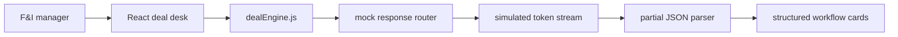
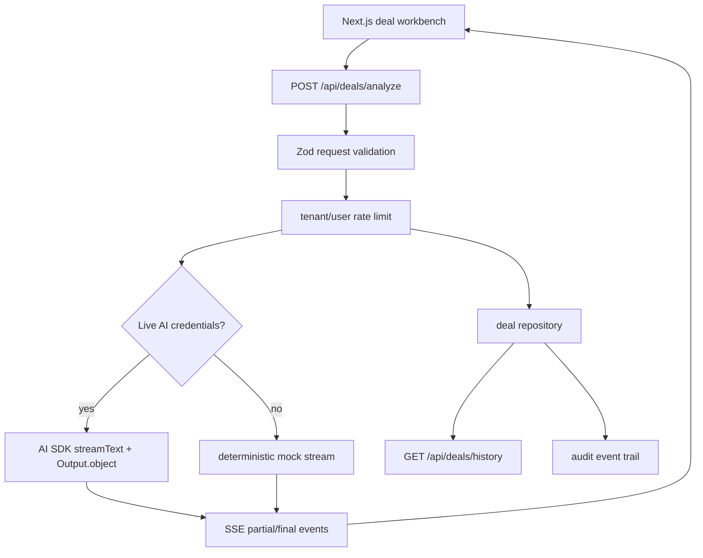
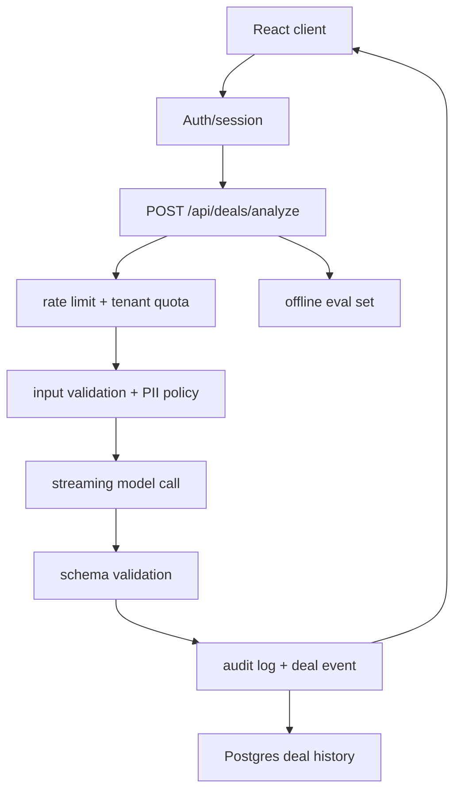

# RevAssist Architecture

RevAssist is a focused AI workflow product for powersports dealership finance and insurance teams. The public demo runs in browser-only mock mode so it can be deployed safely on GitHub Pages, and `pro/` now contains the Next.js fullstack foundation for the production version: a deal-note intake surface, a schema-locked streaming API, rate limiting, audit events, deal history, and CI-backed tests.

## Product Boundary

RevAssist is not a generic chatbot. It accepts messy deal notes and returns four predictable workflow artifacts:

- Deal summary for internal handoff.
- Three F&I add-on recommendations with rationale and price ranges.
- Compliance flags grouped by severity.
- Customer follow-up SMS.

The core product decision is predictability over open-ended conversation. A dealer should be able to paste notes, review structured output, copy the result, and keep moving.

## Current Demo Architecture



The browser demo keeps all product logic in `src/lib/dealEngine.js`:

- Sample deal fixtures.
- Deal profile routing.
- Strict response serialization.
- Response-shape validation.
- Partial JSON parsing for streamed output.
- Copy/export formatting.

Keeping this logic out of React makes the workflow testable and makes the future backend swap smaller.

## RevAssist Pro Foundation



The `pro/` app is production-shaped but CI-safe:

- It defaults to mock streaming so tests and local development do not require secrets.
- It switches to live AI only when `REVASSIST_AI_MODE=live` and gateway/provider credentials are available.
- It uses the Vercel AI SDK v6 structured-output path with `streamText` and `Output.object`.
- It validates request payloads, model outputs, run records, and audit events with Zod.
- It records deal runs and audit events through a repository boundary that can be replaced by Postgres.
- It includes unit tests and Playwright smoke tests for the full generated workflow.

## Production Backend Target



Production responsibilities move behind an authenticated API:

- Protect API keys and model configuration.
- Validate payload size, required fields, and tenant access.
- Stream server-sent events to preserve the fast deal-desk feel.
- Validate generated JSON before the final result is accepted.
- Store deal runs, operator actions, latency, model version, and compliance flags.
- Rate-limit by user, tenant, and dealership location.
- Redact sensitive customer data before logs leave the application boundary.

## API Contract

Request:

```json
{
  "notes": "Customer wants a 2024 Yamaha YZF-R1...",
  "dealerId": "dealer_123",
  "operatorId": "user_456",
  "channel": "deal-desk"
}
```

Streaming event shape:

```json
{
  "type": "token",
  "runId": "run_789",
  "content": "{ \"summary\": ..."
}
```

Final response shape:

```json
{
  "summary": "Plain-English deal recap.",
  "addons": [
    {
      "name": "GAP Insurance",
      "rationale": "Why it fits this deal.",
      "price_range": "$499-$799"
    }
  ],
  "compliance": [
    {
      "flag": "Verify proof of insurance before delivery.",
      "severity": "info"
    }
  ],
  "follow_up_sms": "Ready-to-send customer text."
}
```

## Data Model

Core tables for the production version:

- `deal_runs`: input hash, model version, latency, token count, status, operator, dealership.
- `deal_outputs`: normalized JSON output, validation status, copied sections, regeneration count.
- `audit_events`: run created, output copied, SMS copied, compliance flag acknowledged.
- `eval_cases`: labeled notes, expected flags, expected add-on categories, regression status.

The goal is to make every generated output explainable after the fact without storing more customer data than necessary.

## Reliability And Safety

- Use schema validation on both request and model output.
- Treat compliance flags as reminders, not legal determinations.
- Record model version and prompt version on every run.
- Add timeout and retry behavior around provider calls.
- Fall back to a non-streaming completion if SSE fails.
- Block output if required sections are missing or malformed.
- Keep customer PII out of analytics and external logs.

## Evaluation Strategy

The production app should include an eval suite before using real customer workflows:

- Fixture deals for sportbike, UTV, PWC, cruiser, ATV, and service-contract edge cases.
- Expected compliance categories per jurisdiction.
- Add-on relevance scoring by vehicle type, term length, and down payment.
- Regression checks for malformed JSON and missing sections.
- Latency budget tracking for first token and complete response.

## Interview Talking Points

- Why the UX is structured workflow generation instead of chat.
- How partial JSON parsing improves perceived latency.
- Why backend validation is still required even with structured model output.
- How rate limits, tenant isolation, and audit logs turn a demo into SaaS.
- What data should and should not be stored for dealership AI tooling.
- How evals protect product quality as prompts, models, and rules change.
