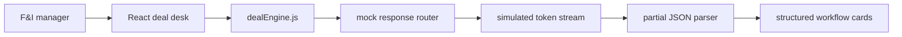
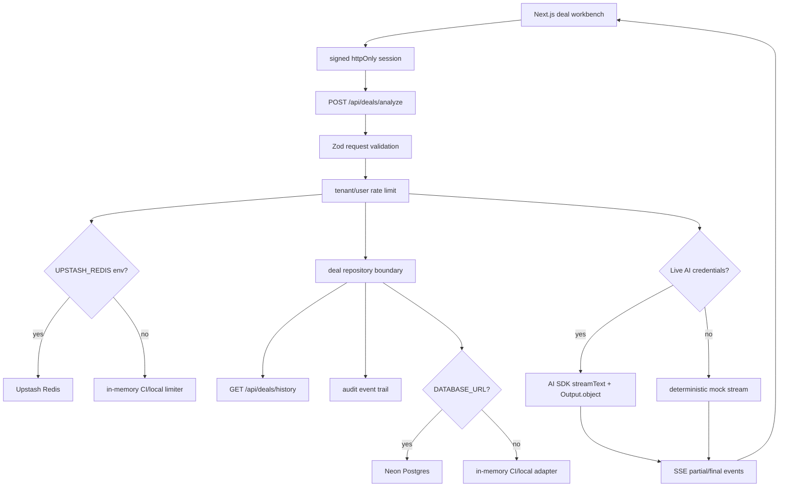
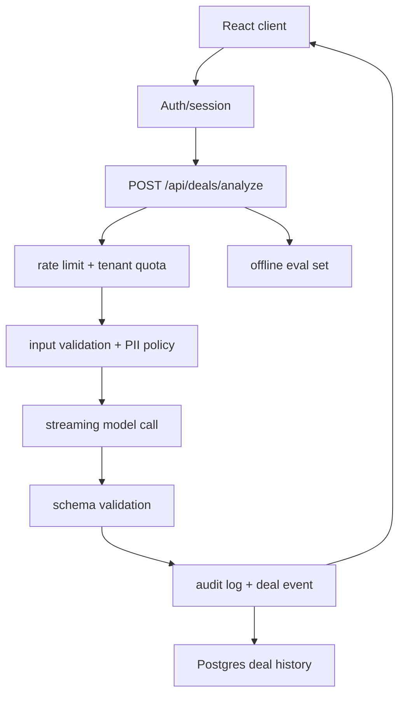

# RevAssist Architecture

RevAssist is a focused AI workflow product for powersports dealership finance and insurance teams. The public demo runs in browser-only mock mode so it can be deployed safely on GitHub Pages, and `pro/` now contains the deployed Next.js fullstack foundation for the production version: a deal-note intake surface, signed session claims, a schema-locked streaming API, Upstash-backed rate limiting, audit events, Neon-backed deal history, and CI-backed tests.

For a portfolio-style narrative of the Pro app, see [RevAssist Pro Case Study](case-studies/revassist-pro.md).

## Product Boundary

RevAssist is not a generic chatbot. It accepts messy deal notes and returns four predictable workflow artifacts:

- Deal summary for internal handoff.
- Three F&I add-on recommendations with rationale and price ranges.
- Compliance flags grouped by severity.
- Customer follow-up SMS.

The core product decision is predictability over open-ended conversation. A dealer should be able to paste notes, review structured output, copy the result, and keep moving.

## Current Demo Architecture



The browser demo keeps all product logic in `src/lib/dealEngine.js`:

- Sample deal fixtures.
- Deal profile routing.
- Strict response serialization.
- Response-shape validation.
- Partial JSON parsing for streamed output.
- Copy/export formatting.

Keeping this logic out of React makes the workflow testable and makes the future backend swap smaller.

## RevAssist Pro Foundation



The `pro/` app is production-shaped but CI-safe:

- It defaults to mock streaming so tests and local development do not require secrets.
- It switches to live AI only when `REVASSIST_AI_MODE=live` and gateway/provider credentials are available.
- It uses the Vercel AI SDK v6 structured-output path with `streamText` and `Output.object`.
- It validates request payloads, model outputs, run records, and audit events with Zod.
- It uses signed `httpOnly` cookies for tenant/operator session claims.
- It documents the managed-auth migration path in [pro/docs/AUTHENTICATION.md](../pro/docs/AUTHENTICATION.md), with the current signed demo session treated as a replaceable adapter.
- It records deal runs and audit events through a repository boundary backed by Neon Postgres when `DATABASE_URL` is present.
- It switches rate limits from in-memory local mode to Upstash Redis when Redis REST credentials are configured.
- It emits structured JSON logs for auth, history, analysis, rate-limit, and failure events without logging raw deal notes.
- It includes a labeled eval suite for profile routing, add-on relevance, compliance coverage, severity coverage, and customer SMS quality.
- It includes unit tests and Playwright smoke tests for the full generated workflow.

## Production Backend Target



Production responsibilities move behind an authenticated API:

- Protect API keys and model configuration.
- Validate payload size, required fields, and tenant access.
- Stream server-sent events to preserve the fast deal-desk feel.
- Validate generated JSON before the final result is accepted.
- Store deal runs, operator actions, latency, model version, and compliance flags.
- Rate-limit by user, tenant, dealership location, and client IP with durable Redis-backed counters in production.
- Redact sensitive customer data before logs leave the application boundary.
- Keep server-owned tenant identity in signed sessions or managed auth claims, never in trusted client fields.

## API Contract

Request:

```json
{
  "notes": "Customer wants a 2024 Yamaha YZF-R1...",
  "channel": "deal-desk"
}
```

Dealer and operator identity come from signed session claims, not client-submitted request fields.

Streaming event shape:

```json
{
  "type": "partial",
  "runId": "run_789",
  "partial": {
    "summary": "Plain-English deal recap..."
  }
}
```

Final response shape:

```json
{
  "summary": "Plain-English deal recap.",
  "addons": [
    {
      "name": "GAP Insurance",
      "rationale": "Why it fits this deal.",
      "price_range": "$499-$799"
    }
  ],
  "compliance": [
    {
      "flag": "Verify proof of insurance before delivery.",
      "severity": "info"
    }
  ],
  "follow_up_sms": "Ready-to-send customer text."
}
```

## Data Model

Core tables for the production version:

- `revassist_deal_runs`: input hash, prompt version, model version, latency, status, output JSON, operator, dealership.
- `revassist_audit_events`: run created, run completed, failures, rate-limit events, actor, tenant, event detail.
- `eval_cases`: labeled notes, expected flags, expected add-on categories, regression status.

The goal is to make every generated output explainable after the fact without storing more customer data than necessary. The SQL bootstrap for the implemented tables lives in `pro/db/schema.sql`.

## Reliability And Safety

- Use schema validation on both request and model output.
- Treat compliance flags as reminders, not legal determinations.
- Record model version and prompt version on every run.
- Add timeout and retry behavior around provider calls.
- Fall back to a non-streaming completion if SSE fails.
- Block output if required sections are missing or malformed.
- Keep customer PII out of analytics and external logs.
- Use structured server logs for request ID, tenant, run ID, model, latency, and rate-limit store.

## Evaluation Strategy

The production app includes a first eval suite before using real customer workflows:

- Fixture deals for sportbike, UTV, PWC, alternate watercraft language, and loose RZR notes.
- Expected profile routing, add-on categories, compliance phrases, severity coverage, and SMS callbacks.
- Regression checks for malformed JSON and missing sections through `dealOutputSchema`.
- CI gate through `npm run eval`, with JSON output available through `npm run eval:json` and a GitHub-readable baseline report through `npm run eval:report`.
- Current deterministic baseline: [pro/docs/EVAL_BASELINE.md](../pro/docs/EVAL_BASELINE.md).
- Provider-backed snapshots are captured through `npm run eval:live:report` and documented in [pro/docs/LIVE_EVAL_SNAPSHOT.md](../pro/docs/LIVE_EVAL_SNAPSHOT.md). They are intentionally separate from CI so model/provider drift is reviewed before launch gates.
- Future live-model snapshots for provider-backed runs, latency budgets, and jurisdiction-specific compliance expectations.

## Interview Talking Points

- Why the UX is structured workflow generation instead of chat.
- How partial JSON parsing improves perceived latency.
- Why backend validation is still required even with structured model output.
- How rate limits, tenant isolation, and audit logs turn a demo into SaaS.
- What data should and should not be stored for dealership AI tooling.
- How evals protect product quality as prompts, models, and rules change.
