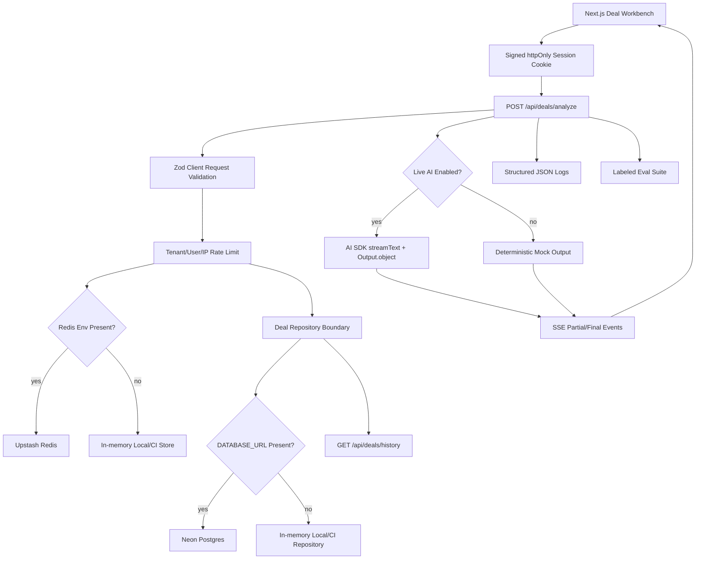

# RevAssist Pro Case Study

RevAssist Pro is a production-shaped AI workflow app for powersports dealership finance and insurance teams. It turns raw deal notes into structured recommendations, compliance reminders, and customer follow-up copy while preserving the operational controls a real SaaS workflow needs: session claims, tenant-aware rate limits, persistence, audit events, evals, CI, and rollback documentation.

## Executive Summary

**Problem:** F&I managers repeatedly convert messy customer/deal context into lender-ready notes, add-on recommendations, compliance checks, and follow-up messages.

**Solution:** A Next.js fullstack app that accepts raw deal notes and streams back a schema-validated workflow object: deal summary, three add-on recommendations, compliance flags, and SMS copy.

**Engineering signal:** The project moves past a tutorial-style AI demo. It has server-owned identity, Zod contracts, streaming APIs, deterministic CI-safe mock mode, live AI readiness, Neon-ready Postgres persistence, Upstash-ready rate limits, structured logs, labeled evals, Playwright smoke tests, and a deployment runbook.

**Why it matters:** Recruiters and interviewers can see product thinking, frontend craft, fullstack architecture, AI workflow design, data modeling, operational maturity, and test discipline in one focused project.

## Product Context

Powersports F&I workflows are high-friction and time-sensitive. A manager often has a buyer profile, vehicle, trade, down payment, term request, and delivery constraints scattered across notes or CRM fields. The product goal is not open-ended chat. The goal is predictable workflow generation that a dealership operator can review quickly and act on.

RevAssist Pro is designed around four outputs:

- A concise internal deal summary.
- Three add-on recommendations with rationale and price range.
- Compliance flags grouped by severity.
- A customer follow-up SMS.

The app optimizes for fast review, auditability, and low operational risk rather than novelty.

## User Workflow

1. The operator opens the deal desk.
2. The client creates a signed server session through `POST /api/auth/demo`.
3. The operator pastes deal notes or chooses a sample deal.
4. `POST /api/deals/analyze` validates the request, checks rate limits, creates a run, and streams partial/final output.
5. The UI renders each structured section as data arrives.
6. The repository records the run lifecycle and audit events.
7. Recent runs and audit events appear in the workbench sidebar.

## System Architecture

## Technical Decisions

| Decision | Why It Was Chosen | Tradeoff |
| --- | --- | --- |
| Structured workflow output instead of chat | Dealership operators need predictable sections they can review and copy | Less flexible than open-ended chat |
| Server-Sent Events | Simple streaming primitive for one-way AI output | Not ideal for collaborative bidirectional editing |
| Zod request/output schemas | Runtime contracts for untrusted inputs and model outputs | Requires maintaining schema and fixtures as product changes |
| Signed `httpOnly` session cookies | Keeps tenant/operator identity server-owned without adding third-party auth too early | Demo session issuer must later be replaced with managed auth |
| Lazy Neon and Upstash clients | Keeps CI and first deploys from failing when Marketplace env vars are absent | Requires fail-fast flags for production strictness |
| Deterministic mock mode | Makes CI stable and allows public portfolio review without secrets | Live-model behavior needs separate snapshots later |
| Labeled eval fixtures | Creates measurable AI quality regression checks | Current suite is fixture-based, not yet provider-backed |
| Structured JSON logs | Supports production triage without leaking raw deal notes | Needs log drain or error tracking after first real deployment |

## Backend Design

The backend lives in Next.js App Router API routes.

Core routes:

- `POST /api/auth/demo` creates a signed demo session.
- `GET /api/auth/session` returns the current public session.
- `DELETE /api/auth/session` clears the session cookie.
- `POST /api/deals/analyze` streams analysis output.
- `GET /api/deals/history` returns recent runs and audit events.
- `GET /api/health` exposes a simple service check.

The analyze route is intentionally layered:

1. Verify signed session claims.
2. Rate-limit by dealer, user, and IP.
3. Validate request payload.
4. Create a deal run.
5. Stream mock or live AI output.
6. Persist completion/failure.
7. Emit audit events and structured logs.

## Data Model

The SQL schema in `pro/db/schema.sql` defines:

- `revassist_deal_runs`: run status, tenant/operator identity, input hash, prompt version, model, latency, output JSON, and failure state.
- `revassist_audit_events`: lifecycle and compliance-adjacent events with tenant, actor, severity, and structured detail.

The system stores an input hash and preview rather than treating raw notes as analytics data. This keeps the operational trail useful while reducing unnecessary customer-data exposure.

## Frontend Design

The workbench is built as a focused internal tool rather than a marketing page.

Key UI choices:

- Dense sidebar for session state, mode, latency, compliance block count, history, and audit trail.
- Large deal-notes input for the primary workflow.
- Sample deal switches for fast demos and smoke tests.
- Streaming output panel that fills progressively.
- Copy-ready result formatting for handoff.
- Responsive layout verified on desktop and mobile with Playwright.

The product surface is designed for repeated use by an operator, not a one-time landing-page impression.

## AI Workflow

The app supports two execution modes:

- `mock`: deterministic outputs selected from fixture-like deal profiles. This is the default for local development and CI.
- `live`: AI SDK structured output through `streamText` and `Output.object` when credentials are present.

The prompt instructs the model to return strict JSON matching the schema. The server still validates the final output because model configuration is not a security boundary.

## Quality Strategy

RevAssist Pro uses multiple quality layers:

- Unit tests for schemas, deterministic output routing, copy formatting, session signing, repository mapping, rate limits, and eval scoring.
- Labeled eval suite with five fixture deals.
- Production build verification.
- Playwright smoke tests for desktop and mobile.
- GitHub Actions workflow for audit, lint, typecheck, unit tests, evals, build, browser install, and smoke tests.

Eval dimensions:

- Profile routing.
- Schema validity.
- Summary relevance.
- Add-on fit.
- Compliance coverage.
- Severity coverage.
- Follow-up SMS usefulness.

## Security And Privacy

Security choices:

- Session claims are signed server-side and sent through `httpOnly` cookies.
- Deal APIs do not trust client-submitted dealer or operator IDs.
- Live AI credentials are server-only environment variables.
- Rate limits are scoped by tenant, user, and IP.
- Production can fail fast if durable DB or Redis configuration is required but missing.
- Structured logs avoid raw deal notes and customer PII.

Remaining hardening:

- Replace the demo session issuer with managed auth.
- Add role-based permissions for dealership admins/directors/operators.
- Add field-level redaction before any external log drain.
- Add jurisdiction-specific compliance rule configuration.

## Reliability And Operations

The deployment runbook documents:

- Vercel project setup.
- Neon and Upstash Marketplace provisioning.
- Environment variable scoping.
- Production validation commands.
- Structured log events.
- Launch checklist.
- Rollback and promote commands.
- Incident triage steps.

This gives the project an operational story, not only an implementation story.

## Performance Considerations

Performance choices:

- Server streaming improves perceived latency.
- Mock mode keeps tests fast and deterministic.
- Output sections render progressively.
- Repository and Redis clients are lazy-initialized.
- Playwright checks guard against mobile/desktop layout overflow.

Future improvements:

- Track first-byte and final-output latency in a metrics backend.
- Add timeout controls around live provider calls.
- Add non-streaming fallback for provider streaming failures.
- Add OpenTelemetry spans after the first real deployment.

## Scaling Path

At 10x usage, the system should evolve toward:

- Managed auth with organization/team membership.
- Per-dealer configuration for add-on catalog, pricing, and compliance rules.
- Durable Redis rate limits enabled in every production environment.
- Postgres-backed run history with retention policies.
- Background workflow for long-running provider retries or post-processing.
- Live-model eval snapshots per prompt/model version.
- Log drain and error tracking.
- Admin analytics for approval rate, blocked deliveries, add-on mix, and response latency.

## What I Would Say In An Interview

**Why structured output instead of chat?**

Dealership F&I work is repetitive and review-heavy. Operators need predictable artifacts, not a conversational surface they have to steer every time.

**Why keep mock mode?**

AI apps need stable tests. Mock mode lets CI prove schema, UI, streaming, history, audit, rate limits, and eval behavior without secrets or provider variance.

**Why validate model output if `Output.object` is used?**

Provider tooling improves shape reliability, but the server still owns the contract. Runtime validation protects downstream UI, persistence, and audit logic.

**How is tenant isolation handled?**

The current version uses signed session claims for dealer/operator identity. The API ignores client-submitted identity fields and scopes history, rate limits, and audit events to server-owned claims.

**What would you improve next?**

I would replace demo auth with managed auth, deploy to Vercel with Neon and Upstash enabled, capture live-model eval snapshots, and add role-specific workflows for managers/directors/admins.

## Proof Points

- Next.js App Router fullstack implementation in `pro`.
- Streaming API with SSE.
- AI SDK structured output integration.
- Zod schemas for requests, outputs, runs, and audit events.
- Signed session-cookie auth boundary.
- Neon-ready Postgres repository.
- Upstash-ready durable rate limiting.
- Structured JSON logs.
- Labeled eval suite.
- CI workflow with audit, lint, typecheck, tests, evals, build, and smoke.
- Deployment and rollback runbook.

## Related Files

- `pro/components/deal-workbench.tsx`
- `pro/app/api/deals/analyze/route.ts`
- `pro/lib/server/auth.ts`
- `pro/lib/server/repository.ts`
- `pro/lib/server/rate-limit.ts`
- `pro/lib/evals/fixtures.ts`
- `pro/lib/evals/scoring.ts`
- `pro/db/schema.sql`
- `pro/docs/DEPLOYMENT.md`
